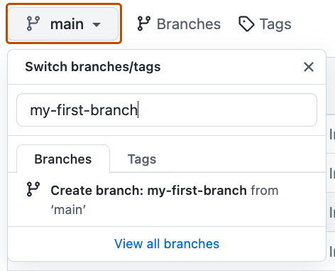
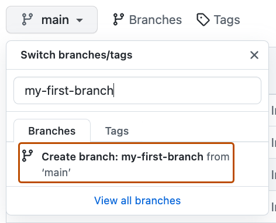

## Step 1: 新建分支

_欢迎来到 "GitHub 入门课程"! :wave:_

**什么是GitHub**: GitHub 是一个使用 _[Git](https://docs.github.com/get-started/quickstart/github-glossary#git)_ 进行版本控制和协作的代码托管平台，是一个分享和贡献开源软件的流行平台。

📺 可以看看这段 Youtube 介绍视频：[什么是 GitHub?](https://www.youtube.com/watch?v=pBy1zgt0XPc)

**什么是仓库（Repository）？**：_[仓库](https://docs.github.com/get-started/quickstart/github-glossary#repository)_ 是 GitHub 最核心的元素。一个仓库就像一个项目文件夹，里面包含所有项目文件（包括文档），并存储每个文件的修改历史记录。 仓库可以有多个协作者，仓库可以是公开的，也可以设置为私有的。欲了解更多信息，请查看 GitHub 文档中的"[关于仓库](https://docs.github.com/en/repositories/creating-and-managing-repositories/about-repositories)"。

**什么是分支（Branch）？**: _[分支](https://docs.github.com/en/get-started/quickstart/github-glossary#branch)_ 是您仓库的并行版本。每个仓库在创建时都有一个默认主分支，通常叫 `main`，它代表项目的主线版本。

创建新的分支可以让你从 main 复制一份独立的副本，方便修改、测试或开发新功能，而不会影响主项目。
许多人会为特定功能开独立分支，这样可以在不干扰他人的情况下进行开发。

使用分支的好处是，你的修改和主分支是隔离的 —— 换句话说，每个人的工作都能保持安全。
更多介绍请看文档：[关于分支](https://docs.github.com/en/pull-requests/collaborating-with-pull-requests/proposing-changes-to-your-work-with-pull-requests/about-branches)。

**什么是 Profile README？**: _[Profile README](https://docs.github.com/account-and-profile/setting-up-and-managing-your-github-profile/customizing-your-profile/managing-your-profile-readme)_ 是 GitHub 个人主页上的自我介绍部分。你可以在这里展示自己的信息、项目或兴趣。
GitHub 会把它显示在你个人主页的顶部。更多内容可参考 "[管理个人资料自述文件](https://docs.github.com/en/account-and-profile/setting-up-and-managing-your-github-profile/customizing-your-profile/managing-your-profile-readme)".

### :keyboard: 实操环节：创建你的第一个分支

1. 打开一个新的浏览器标签页，进入你刚创建的仓库。保持这个页面不关，边看步骤边操作。
2. 在仓库顶部导航栏中，点击 **< > Code** 选项。

   

3. 点击 **main** 分支的下拉菜单。

   

4. 在输入框中输入新分支名 `my-first-branch`。注意：必须使用这个名字，才能触发课程后续流程。

5. 点击 **Create branch: my-first-branch** 按钮来创建分支。

   

6. 分支推送到 GitHub 后，Mona 会自动开始检查你的任务。稍等片刻，她会在评论中回复进度与下一步任务。

遇到问题? 🤷
 

如果你没有收到反馈，可以检查一下这些
- 确保你创建的分支名称完全是 `my-first-branch`，不要加任何前缀或后缀

