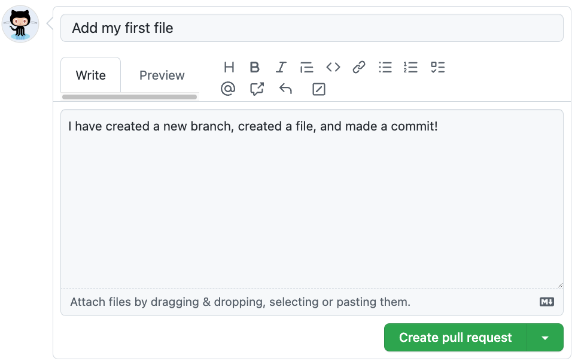

## Step 3: 发起 Pull Request（合并请求）

_你已经完成提交，干得漂亮! :sparkles:_

现在，你已经修改了项目并完成了一次提交，是时候把这些更改分享给别人了 —— 通过 Pull Request（简称 PR）。

**什么是拉取请求(pull request)**: _[pull request](https://docs.github.com/en/get-started/quickstart/github-glossary#pull-request)_ 是团队协作的核心方式。它展示了你在分支上所做的更改，让其他人可以查看、讨论、提出修改建议，或直接接受你的更改。

简单来说，它会把你当前分支上的内容，与主分支 `main` 进行对比，并提议把这些改动合并进去。更多关于拉取请求，请查看文档"[关于 pull requests](https://docs.github.com/en/pull-requests/collaborating-with-pull-requests/proposing-changes-to-your-work-with-pull-requests/about-pull-requests)"。

### :keyboard: 实操环节: 创建 Pull Request

您可能已经注意到，提交完成后 GitHub 会在页面上方提示 “你刚刚推送了新提交”，并显示一个按钮 **Compare & pull request**。

如果点击这个按钮，GitHub 会自动为你创建一个 Pull Request，跳过后续的大部分步骤（直接看第 6 步）。
如果你想手动创建，请按下面步骤操作：

1. 点击仓库顶部菜单栏里的 **Pull requests** 标签页。
2. 点击 **New pull request**。
3. 在下拉菜单中选择以下分支。
   - **base:** `main` （表示目标分支）
   - **compare:** `my-first-branch`

   

4. 点击 **Create pull request**。
5. 为你的 Pull Request 添加标题。默认标题是分支名，这里可以改成 `Add my first file`.
6. 下面输入框中输入描述性的话，说明你做了那些修改

   

7. 点击 **Create pull request**。然后页面会自动跳转到你新建的拉取请求

8. 现在你已经创建了一个用于协作的 Pull Request，Mona 会自动开始检查你的任务。稍等片刻，她会在评论中回复进度与下一步任务。

遇到问题了吗？🤷
 

若未收到反馈，请检查以下事项：

- 确保你的 Pull Request 标题是正确的。
- 确保你的 Pull Request 已经填写了描述内容。

