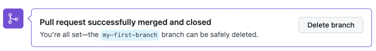

## Step 4: 合并 Pull Request

_你已经创建了 Pull Request，做得很好! :sunglasses:_

Pull Request 的意义在于让他人有机会在代码合并到主分支之前，先审查并提出意见。
当所有讨论完成并确认无误后，就可以将这个分支的修改正式合并进主分支。
You successfully created a pull request. Now it's time to merge it!

**什么是合并(merge)?**: [合并（merge）](https://docs.github.com/en/get-started/quickstart/github-glossary#merge)_ 的过程，就是把你分支上的改动整合进 main 分支。
一旦合并完成，你的修改就会成为主分支的一部分。更多详细说明可参阅 "[Merging a pull request](https://docs.github.com/en/pull-requests/collaborating-with-pull-requests/incorporating-changes-from-a-pull-request/merging-a-pull-request)"。

### :keyboard: 实操环节: Merge the pull request

1. 点击 **Merge pull request**
  
   > **注意**: 可能会看到新的 Pull Request 上正在运行一些 workflows（工作流），这会导致 “Merge” 按钮暂时无法点击。稍等片刻，等这些流程执行完毕后，Merge 按钮就会重新可用。

2. 点击 **Confirm merge**，确认合并

   > 提示：你有没有发现这个对话框看起来和前面的 “添加文件”很像？其实合并（merge）本质上也是一种提交（commit）！

3. 当分支成功合并到 `main` 后，这个分支就没用了，你可以点击 Delete branch 将其删除。

   

4. 现在你的工作已经被合并了，Mona 会进行确认并给出一些最终的审查内容。做得不错！🎉

遇到问题?? 🤷
 

若未收到反馈，请检查以下事项：

- 确保你已经完成前面的课程。如果还没有通过，这一步的合并按钮会是灰色不可点击状态。

